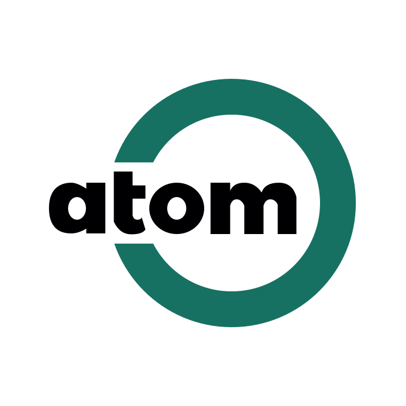

  

 

  

 

# AtomTools

## 极速、强大、开箱即用的 TypeScript 工具库

### 简介

🌟 **AtomTools** 是一个现代、基于 TypeScript 的 JavaScript 工具库，旨在提供项目开发中不可或缺的实用工具函数。通过简单的导入语句，您可以快速地将这些工具函数集成到您的项目中，无需任何复杂配置。

### 选择 AtomTools 的理由

在传统的业务项目开发中，开发者经常面临编写大量重复的函数、类型定义和常量的需求。这些代码往往需要在不同项目间移植和重用，导致效率低下。

**AtomTools** 的设计初衷是提供一个高效、便捷的解决方案，帮助开发人员轻松管理和使用这些常用的编程元素。使用 AtomTools，您将能够简化开发流程，更专注于核心业务逻辑的实现。

### 特性亮点

- 🌈 **全面兼容**：完美兼容任何使用 JavaScript 或 TypeScript 开发的项目，包括微信小程序。
- 🚀 **极速体验**：提升开发速度，让编程更快捷、更高效。
- 📠 **类型安全**：完全采用 TypeScript 编写，提供精确的类型提示，增强代码健壮性。
- 🍃 **轻量设计**：注重性能和实用性，无冗余依赖，保持库的轻量化。
- 📦 **即装即用**：安装后即可立即投入使用，无需复杂配置。

## 开发者社区

寻找志同道合的朋友一起参与 **AtomTools** 的开发。如果你对 TypeScript、JavaScript 工具库开发充满热情，欢迎加入我们，共同打造一个更加强大、易用的编程工具集。

**AtomTools** 致力于成为一个全方位的前端开发工具库，帮助开发者提升生产力，实现更优雅的编程体验。加入我们，一起构建未来！
